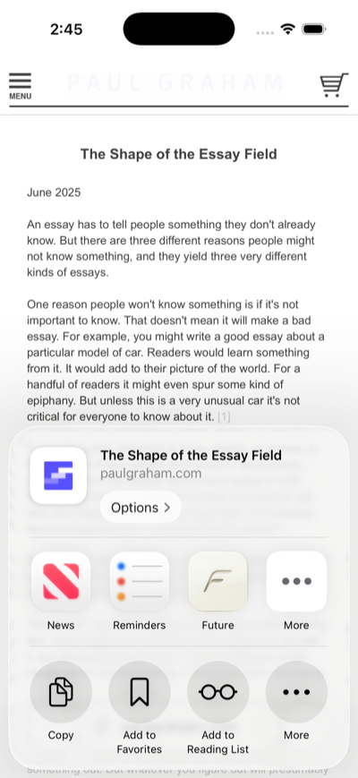
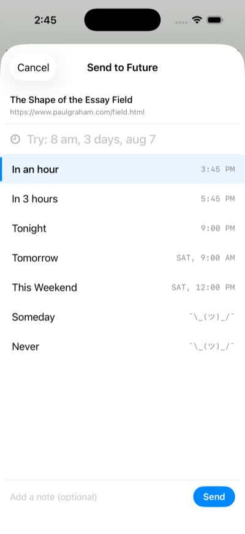
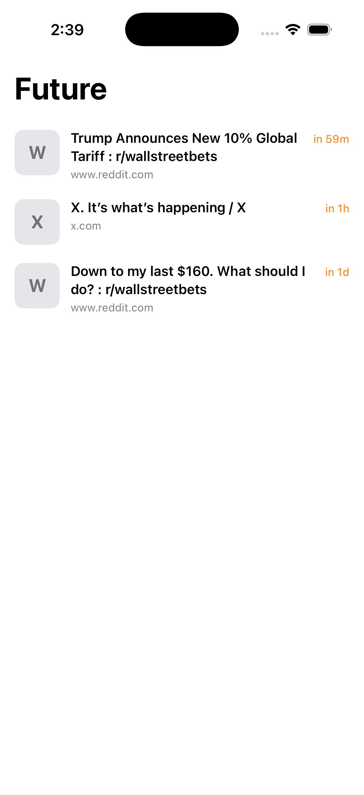

<p align="center">
  
</p>

<h1 align="center">Future</h1>

<p align="center">Send links to your future self.</p>

<p align="center">
  
  
  
</p>

## About

Future is a lightweight iOS app that lives in your share sheet. Save a link from any app, pick when you want to see it again, and forget about it. Future will notify you when it's time.

## Features

- **Share extension** — send links from Safari, Reddit, Twitter, or any app
- **Natural language time picker** — type "tomorrow", "3 days", "aug 7" or pick from presets
- **On-device AI fallback** — uses FoundationModels to parse ambiguous time inputs
- **Scheduled notifications** — get notified exactly when your link is ready
- **Auto-labeling** — on-device LLM categorizes your links automatically
- **URL thumbnails** — fetches og:image previews via `LPMetadataProvider`
- **"Never" mode** — save links without a delivery date as bookmarks
- **Snooze** — reschedule delivered links from the notification itself

## Requirements

- iOS 26.0+
- Xcode 26+

## Architecture

```
Future/                     Main app target
FutureShareExtension/       Share extension target
Packages/FutureShared/      Shared Swift package (models, storage, notifications)
```

Both targets share data through an App Group container via `UserDefaults` and file-based thumbnail storage.

## License

MIT
